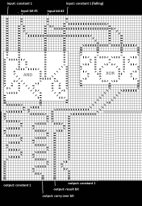

# domino-computer
A virtual domino-piece based computer to add small numbers

Idea derived from watching the video
`The 10000 domino computer
by standupmaths on youtube from 2014`

## README is organized as:

1. Quick start - add two bits
2. Current limitations in pre-release
3. User interface
4. Contact

## 1. Quick start

Compile the program with any suitable C++ compiler and start it.
A grid of cells is displayed. 

Press F3 to load the 1-bit-adder.

The topmost 4 domino pieces are the input to the gate. The leftmost
and rightmost (marked with a red line) are constant 1 and need to be
marked red. 

The middle two represent the two input bits to add.
Click on any one or two of those fields repeatedly with the right mouse
button till a red line is placed above the black domino piece. This
indicates a binary 1, no red line means binary 0.

With the arrow down key one can move a page down to the exit of the 
gate and output.

Press F9 to start the domino calculation (all red marked pieces fall
at the same start time). After some seconds the results fall in.

The bottommost four pieces are the output, again leftmost and rightmost
are constant 1 and fall under any input, the left of the middle two is the carry-over
bit and the right one the result.

## 2. Current limitations in pre-release

- The pre-release was coded solely for proof-of-principle.
- It only can load and save to one file named "domino.feld". If another 
grid is to be loaded,
files have to be copied manually using a file manager software.
- Current overall size of the grid is limited to 256 columns and 320 rows.
- If automatic redrawing does not work, the user can press F5 manually to repaint the grid.
- Repeated clicking into one field needs some milliseconds of pause between 
the clicks.
- I did not check every domino piece orientation next to every other, especially when there are two
pieces in one field.
- Currently only a 1-bit-adder and several boolean gates are supported. 
The former in a file, the latter can be inserted at any grid point.

## 3. User interface

Displayed are always 64x40 grid cells. The underlying domino grid contains 
4 pages of that size in the x direction
(accessible by arrow keys left and right) and 8 pages in the y direction 
(arrow keys up and down).

### Setting a domino piece

Click in any grid field repeatedly with the left mouse button until the domino 
piece (or
the empty field) of choice appears. A field can hold one or two pieces in 
different orientation (e.g. /\ meaning two upright domino pieces in sort of a 90 degree orientation).

### Setting a start field

Using the right mouse button, any field can be marked (red line) as a 
starting field,
where one of the arbitrarily many fingers will tip the domino piece when 
the calculation
is started. Repeatedly clicking will change the orientation from which the 
piece is set into roll

The finger comes from outside red towards red and then touches the domino 
piece to generate a specific falling direction.

### Keyboard controls

- F2 - Saves the current field into file "domino.feld"
- F3 - Loads the field from fixed file "domino.feld"
- F5 - redraws the screen.
- F9 - starts the calculation and continues until no further falling piece is present.

### Setting gates, tunnels and result fields

#### Gates

The software currently supports AND, NAND, XOR, OR and NOT-gates. They can 
be placed into the
grid at any position by first pressing a specific key (not holding it down) 
and then clicking with the left mouse button
into the grid which will become the upper left corner of the gate.

- `AND: Ctrl-A`
- `NAND: Ctrl-B`
- `NOT: Ctrl-N`
- `OR: Ctrl-O`
- `XOR: Ctrl-X`

#### Tunnels

Sometimes it cannot be evaded that lines of domino pieces cross each other 
but shall not
interfere. Therefore tunnels are used.

Press Ctrl-T and then click with the left mouse button in a cell which is the 
start of
the tunnel and after that with the left mouse button in the cell that will 
be the exit of the tunnel. The tunnel is marked as two parallel 
short gray lines connecting
start and exit.

#### Result fields

Press Ctrl-E and click left on a domino-piece containing field. It turns 
green. Next to that field during calculation the number
of steps the path took to arrive at that domino piece if falling will be 
displayed (nothing, if it does not fall).
That way one can synchronize gate result lines by introducing loops e.g.

### Erasing, moving

- Erasing a tunnel is done the same way as setting one by clicking on fields 
that already have been marked as a tunnel
in the same key/click order.

- Erasing a result field is done the same way as marking a field as result.

- Erasing a rectangle of grid cells is done by pressing DEL, then clicking with 
the left mouse button onto the left upper grid and then onto the right 
bottom corner of a rectangle of choice. All 
in that area will be removed.

- Pressing Ctrl-M and then clicking on two different grid cells as for erasing
allows one to move that rectangle with
all its interior one position by afterwards pressing one of the arrow keys.

## 4. Contact

Direct comments to: marcm200@freenet.de

Marc Meidlinger, July 2019

